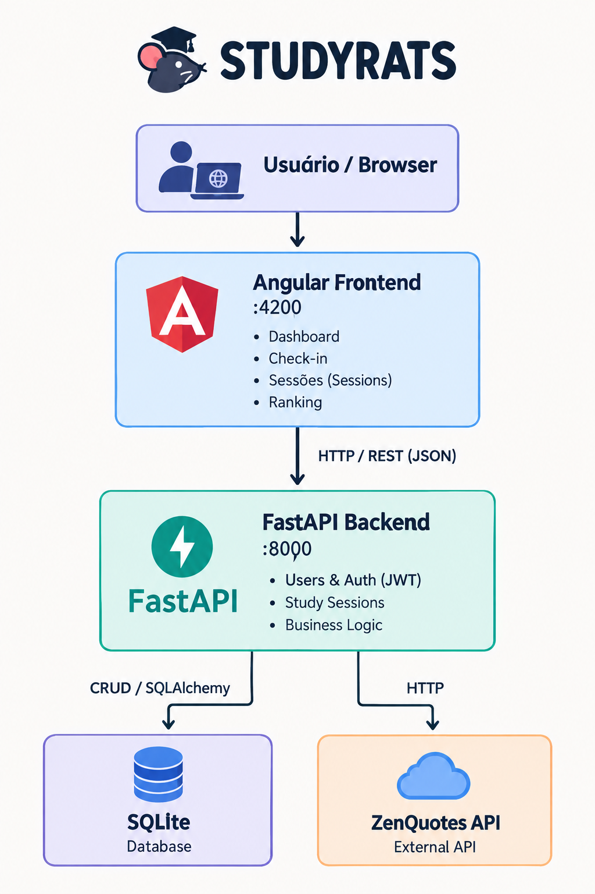

# StudyRats — Frontend

Frontend da aplicação **StudyRats**, desenvolvido com Angular para auxiliar estudantes no acompanhamento de suas sessões de estudo.

A aplicação permite que usuários criem uma conta, realizem login, registrem sessões de estudo, acompanhem seu tempo de estudo, consultem suas sessões e visualizem o ranking de usuários. O frontend se comunica com uma API desenvolvida em FastAPI por meio de requisições HTTP e utiliza autenticação baseada em JWT.

---

## 🛠️ Tecnologias Utilizadas

* **Angular** (Framework principal)
* **TypeScript**
* **Bootstrap & Bootstrap Icons** (Estilização e UI)
* **Sass**
* **Chart.js & ng2-charts** (Gráficos)
* **Docker & Nginx** (Containerização e deploy)

---

## ✨ Funcionalidades

### 🔐 Autenticação
* Cadastro de usuário, Login e Logout.
* Autenticação segura utilizando JWT.
* Proteção das rotas que exigem usuário autenticado.

### 📊 Dashboard
* Saudação personalizada ao usuário e exibição de frase motivacional.
* Métricas: Tempo total estudado e quantidade de sessões.
* Posição do usuário no ranking e resumo do Top 3.

### ⏱️ Check-in e Sessões
* **Check-in:** Registro de uma nova sessão de estudo com informações da matéria, duração e validação dos dados enviados.
* **Sessões:** Listagem das sessões do usuário, com opções de edição e exclusão.

### 🏆 Ranking
* Ranking geral dos usuários com destaque para o Top 3.
* Gráfico interativo com o tempo total de estudo.

---

## 🏗️ Arquitetura e Integração

A aplicação frontend utiliza Angular como camada de apresentação e se comunica com o backend por meio de uma API REST (JSON).

O backend (desenvolvido em **FastAPI** com banco de dados **SQLite**) é responsável pela autenticação, persistência dos dados, gerenciamento das sessões de estudo, ranking e integração com a **ZenQuotes API** (serviço externo utilizado para fornecer as frases motivacionais).

## Arquitetura



---

## ⚙️ Pré-requisitos

Para executar o projeto **localmente** (sem Docker), é necessário ter instalado:
* [Node.js](https://nodejs.org/) e npm
* [Angular CLI](https://angular.io/cli)
* [Git](https://git-scm.com)

Para executar utilizando **Docker**:
* [Docker Desktop](https://www.docker.com/products/docker-desktop/)
* [Git](https://git-scm.com)

---

## 🚀 Como Executar o Projeto

### 1. Configuração do Backend
O frontend depende da API do StudyRats para funcionar. Por padrão, a aplicação espera que o backend esteja disponível em:
`http://localhost:8000`

⚠️ *Certifique-se de que o backend esteja executando antes de testar funcionalidades de login, cadastro, sessões e ranking.*

### 2. Clonar o repositório
Clone o repositório:
```bash
git clone <URL_DO_REPOSITORIO>
cd studyrats-frontend

```

## ▶️ Executando localmente

### 1. Instalar as dependências
Instale as dependências:
```bash
npm install

```

### 2. Iniciar o servidor
Para iniciar o servidor do Angular:

```bash
ng serve

```

Acesse `http://localhost:4200` no seu navegador. A aplicação será recarregada automaticamente caso os arquivos sejam modificados.


## 🐳 Executando com Docker

O frontend utiliza um build de múltiplas etapas (*multi-stage build*). Primeiro, uma imagem Node.js gera o build Angular. Depois, uma imagem Nginx é utilizada para servir os arquivos estáticos de forma otimizada.

**Construir a imagem:**

```bash
docker build -t studyrats-frontend .

```

**Executar o container:**

```bash
docker run -d -p 4200:80 --name studyrats-frontend studyrats-frontend

```

Acesse `http://localhost:4200`.

**Parar e remover o container:**

```bash
docker stop studyrats-frontend
docker rm studyrats-frontend

```

---

## 📡 Comunicação com a API e Autenticação

A comunicação com o backend é centralizada em serviços Angular:

* `AuthService`: Autenticação, cadastro e controle de sessão do usuário.
* `StudySessionService`: CRUD de sessões de estudo.
* `RankingService`: Consulta do ranking global.
* `QuoteService`: Consulta da frase motivacional.

Após o login, o token JWT recebido é armazenado no `localStorage`. As requisições autenticadas utilizam um **HTTP Interceptor**, que adiciona automaticamente o cabeçalho de autorização:

```http
Authorization: Bearer <token>

```

As rotas protegidas utilizam um *Guard* (`AuthGuard`) para impedir o acesso de usuários não logados.

---

## 🛣️ Rotas da Aplicação

| Rota | Descrição | Autenticação |
| --- | --- | --- |
| `/login` | Login do usuário | Não |
| `/register` | Cadastro de novo usuário | Não |
| `/dashboard` | Dashboard principal | Sim |
| `/check-in` | Registro de nova sessão | Sim |
| `/sessoes` | Gerenciamento das sessões | Sim |
| `/ranking` | Ranking dos usuários | Sim |

---

## 📜 Scripts Principais (`package.json`)

| Comando | Descrição |
| --- | --- |
| `npm install` | Instala as dependências |
| `npm start` / `ng serve` | Inicia o servidor local de desenvolvimento |
| `npm run build` | Compila a aplicação gerando artefatos de produção (`dist/`) |
| `npm test` | Executa os testes automatizados (se configurados) |
